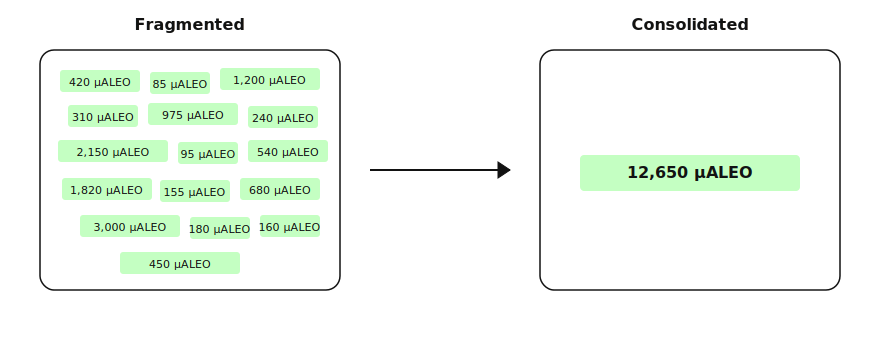
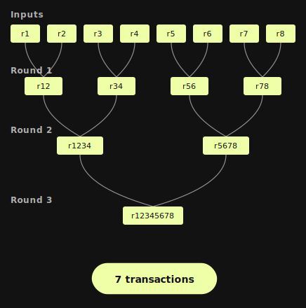
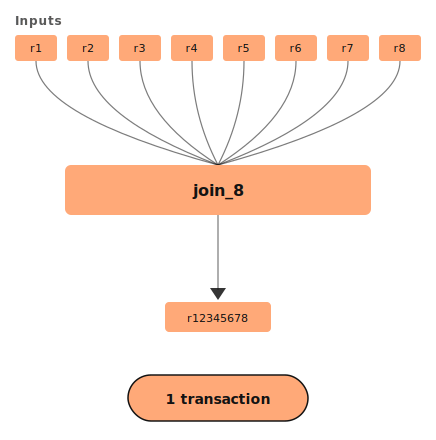
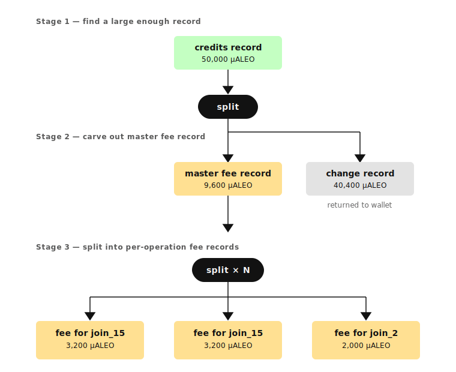

# Autojoin Blog Post [DRAFT]

## Overview

Aleo provides transaction privacy at the protocol level by encrypting account balances and transfers onchain. Unlike fully public chains, an account's private balance is the sum of a set of encrypted records. Each record holds a fixed amount of value, akin to the UTXO model or bills of real world cash.

Because records are private and only spendable by their owner, the protocol cannot aggregate them on the user's behalf. Routine activity therefore tends to leave many small records in a wallet over time, a condition known as record fragmentation. A fragmented wallet may hold enough total balance to cover a given payment and still be unable to send that payment in a single transaction, because each transaction can consume only a limited number of records as inputs. The payment then has to be broken into several smaller transactions, each of which pays its own fee.

Autojoin is an open-source library that handles this consolidation at the application layer. It combines a wallet's small records into a single record using as few transactions as possible, and supports both public and private fee modes. The source is available at the [autojoin repository](https://github.com/AleoNet/example-autojoin).

## Records And Fragmentation

Each Aleo transaction that privately transfers value consumes one or more existing records and emits new records, including a change record returned to the sender when applicable. Ordinary activity therefore accumulates change records in the sender's wallet over time. Accounts that receive frequent small payments accumulate them faster.

The cost of fragmentation shows up when a fixed amount needs to be sent. To send 100 credits, the wallet has to assemble records that sum to at least 100 credits and pass them as inputs to a transaction. Aleo caps each transaction at 16 record inputs, so any single transaction can draw from at most 16 of the wallet's records. If the largest 16 records together fall short of the target amount, the payment cannot be made in a single transaction at all. Even when 16 records are enough to cover the amount, sending from a heavily fragmented wallet often requires several transactions, each of which generates its own zero-knowledge proof and pays its own fee.

Consolidation reduces the record count, so a fixed payment can be made in a single transaction without bumping into the input cap.



## The Join Primitive

Every valid token program on the network defines a `join` transition that consumes two existing records and produces one output record whose amount equals their sum. Repeated joins reduce any number of records to a single record.

Two factors determine the total cost of a consolidation. The first is the number of join transactions broadcast. The second is the wall-clock time required, which is dominated by zero-knowledge proof generation and onchain confirmation.

The two strategies described below organize the join calls differently and trade off these costs accordingly.

## Sequential/Pairwise Reduction

The simplest strategy is pairwise reduction. Records are grouped into pairs, each pair is joined to produce one record, and the procedure is repeated on the outputs until a single record remains.



Within each round, all pair joins can be dispatched concurrently, so the wall-clock duration of a round is approximately the duration of one transaction.

```typescript
const pairs: [AleoRecord, AleoRecord][] = [];
for (let i = 0; i + 1 < current.length; i += 2) {
  pairs.push([current[i], current[i + 1]]);
}

const joinedRecords = await Promise.all(pairs.map(async ([a, b]) => {
  const { transactionId, newRecord } = await this.join2(a, b);
  await this.aleoClient.waitForTransactionConfirmation(transactionId);
  return newRecord;
}));
```

Pairwise reduction requires `N − 1` join transactions to consolidate `N` records. Both transaction count and total wall-clock time are linear in `N`.

## Batch Joins

In scenarios where a user has a large number of records, the basic pairwise joining strategy becomes both cost and time inefficient.  Custom wrapper programs expose a family of higher-arity transitions, `join_3` through `join_16`. Each transition consumes up to 16 records (the upper limit enforced by snarkVM) and produces one record holding their sum in a single transition.

```leo
import credits.aleo;

program batch_join_credits.aleo {
    fn join_3(
        token_1: credits.aleo::credits,
        token_2: credits.aleo::credits,
        token_3: credits.aleo::credits
    ) -> credits.aleo::credits {
        let i1 = credits.aleo::join(token_1,token_2);
        let output = credits.aleo::join(token_3, i1);
        return output;
    }

    fn join_4(
        token_1: credits.aleo::credits,
        token_2: credits.aleo::credits,
        token_3: credits.aleo::credits,
        token_4: credits.aleo::credits
    ) -> credits.aleo::credits {
        let i1 = credits.aleo::join(token_1,token_2);
        let i2 = credits.aleo::join(token_3,token_4);
        let output = credits.aleo::join(i1, i2);
        return output;
    }

    // join_5 ... join_16
}
```

A `join_N` call net removes `N − 1` records from the wallet per transaction. With `join_16`, a consolidation of 100 records that would require 99 pairwise transactions completes in 7 batch transactions distributed over two rounds.  For input sizes typical of fragmented user wallets, the batch strategy terminates in one or two rounds.



The batch strategy partitions input records into batches of up to 16, dispatches the batches concurrently, and applies the same procedure to the intermediate outputs.

```typescript
while (current.length > 1) {
  const batches: AleoRecord[][] = [];
  while (current.length > 0) {
    batches.push(current.splice(0, Math.min(current.length, 16)));
  }

  const joinedRecords = await Promise.all(batches.map(async (batch) => {
    const { transactionId, newRecord } = await this.joinN(batch);
    await this.aleoClient.waitForTransactionConfirmation(transactionId);
    return newRecord;
  }));

  current = joinedRecords;
}
```

## Intermediate State And Retry Behavior

After a join transaction is broadcast, its output record is required as input to the next round. The strategy does not re-scan the chain between rounds. Instead, it decrypts the output ciphertext from the broadcast response and forwards the resulting record into the subsequent round.

<!-- ```typescript
const firstOutput = transaction.execution?.transitions?.[records.length - 2]?.outputs?.[0];

const newRecord = this.aleoClient.recordCipherTextStringToAleoRecord(
  firstOutput.value,
  this.account,
  records[0].programName,
  transaction.id,
);
``` -->

Forwarding intermediate records in memory eliminates a round trip to a record scanning service between rounds. In practice, however, transactions that use these intermediate records may initially be rejected if the node being broadcast to hasn't detected the intermediate record as finalized onchain yet. Failures are handled with bounded exponential backoff.

```typescript
async submitProvingRequestwithRetries(provingRequest, retries, attempts = 0) {
  try {
    return await this.submitProvingRequest(provingRequest);
  } catch (e) {
    if (retries <= 0) throw e;
    await sleep(5000 * (attempts + 1)); // exponential backoff
    return this.submitProvingRequestwithRetries(provingRequest, retries - 1, attempts + 1);
  }
}
```

## Private Fees

An Aleo transaction may pay its fee from a public onchain balance or from a private Aleo Credits record. Private fee mode keeps the fee payment encrypted alongside the rest of the transaction.

When a transaction pays its fee privately, the fee record occupies one of the 16 input slots that would otherwise be available to the function being executed. The largest batch join that fits alongside a private fee is therefore `join_15`. It consumes 15 records, accepts 1 fee record, and uses all 16 input slots.

For a consolidation of N records under private fees, the number of `join_15` calls is:

$$\left \lfloor {\frac{N - 1}{14}}\right \rfloor $$

followed by a single cleanup call to the `join_X` function, where `X` is:
$$((N - 1)  \mod 14) + 1$$

The divisor is 14 rather than 15 because each `join_15` invocation consumes 15 records and produces 1, for a net reduction of 14 records per transaction.

### Fee Amount Precision

A private fee record must hold EXACTLY the amount needed for the operation it pays for. Underpayment causes the transaction to fail at execution time. Overpayment causes a residual record to be returned to the wallet, which itself contributes to fragmentation.

Fortunately, Aleo fees are deterministic. The fee for a given function is fixed at compile time by the circuit's complexity, and there is no congestion-dependent pricing. The full fee budget can therefore be computed before any join is broadcast. 

Once the total budget is known, the individual fee records can be generated in two splits of an existing credits record. The first split carves out a master fee record equal to the total budget. The second split divides the master into per-operation fee records, each sized for the specific join it will pay for.



### Implicit Split Costs

The `split` operation for Aleo Credits does not incur the standard onchain execution fee.  Rather, it has an implicit cost deducted directly from the record being split. The implicit cost is fixed by the protocol and is not represented as a separate fee record. A budget that accounts only for join fees and ignores the splits required to prepare them will under-fund the operation. Both quantities are deterministic, so they can be incorporated into the same up-front calculation.

## Example

The following sequence traces a private-fee batch autojoin over 30 records.

The library first plans the join sequence. Since $⌊29/14⌋ = 2$, the consolidation requires two `join_15` calls and one final `join_2` (since $(29 \mod 14) + 1 = 2$). The library next computes the fee for each operation type and prepares three fee records via split. Two are sized for the `join_15` operations and one for the final `join_2`.

In the first round, the library partitions the 30 records into two batches of 15 and executes both `join_15` calls concurrently, each paired with a dedicated fee record. The round produces 2 intermediate records. In the second round, the library combines the 2 intermediate records via `join_2` using the remaining fee record. The round produces 1 final record.

The full operation consolidates 30 records using 3 join transactions distributed over 2 rounds.

## Summary

Aleo's record model is a powerful privacy primitive that comes with operational tradeoffs. The most visible consequence is a UX gap. A user's wallet can display a balance that the user cannot actually send in a single transaction, because the records that sum to that balance exceed the per-transaction input cap. Sending the full balance instead requires multiple transactions, each paying its own fee and waiting on its own zero-knowledge proof. The user is left to either reason about records directly or hit confusing failures when the wallet's apparent balance does not behave like one.

Autojoin is published as an open-source reference for handling these mechanics on Aleo. The patterns are not unique to it; they are common to any non-trivial Aleo application. Having a concrete implementation to read gives teams new to the network something to adapt rather than design from scratch.

The source code is available at the [example-autojoin](https://github.com/AleoNet/example-autojoin) repository under the [AleoNet](https://github.com/AleoNet) organization on Github.
